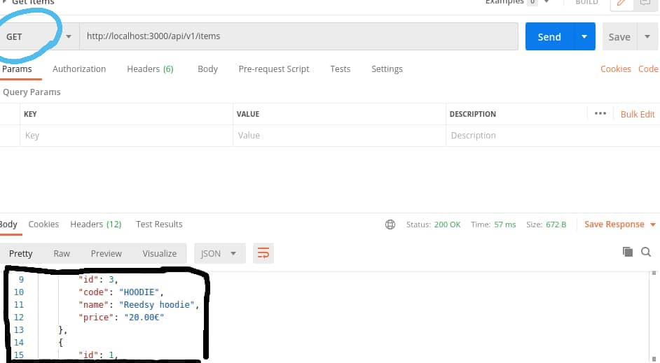
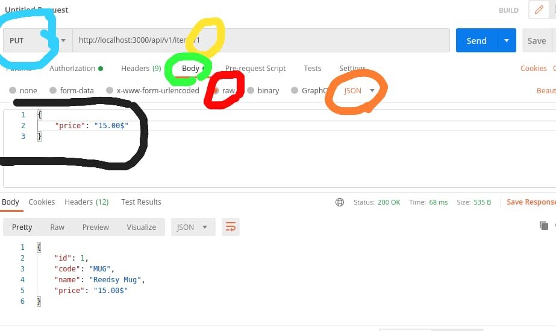
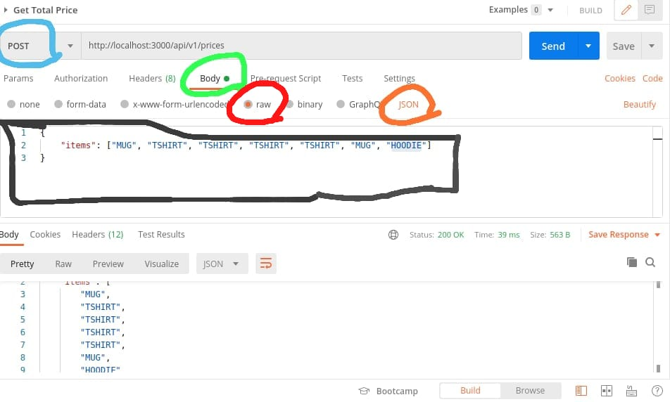
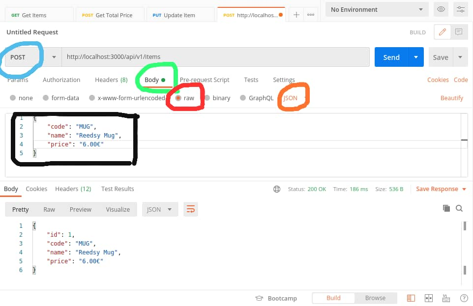

# XXX Merchandising Store
Welcome to the Merchandising Store API! You can use our API to access Merchandising Store API endpoints, which can get information on various items in our database.
It contains the following API endpoints

# Add a new item to the store endpoint: 
  API endpoint to *Create a new item* in the store
  > A successful API request will
   - return HTTP 200 OK status
   - add a new item to the database and populate it as a json object in the response body.
  
  > An unsuccessful API request will 
   - return HTTP 200 OK status
   - Populate an error message *Item not created* in the response body

# Get all items endpoint:
  API endpoint to *Fetch all items* in the store
  > A successful API request will
   - return HTTP 200 OK status
   - fetch all items in the store and populate it as a json object in the response body
  
  > An unsuccessful API request will return HTTP 404 Nt Found status

# Update an item endpoint: 
  API endpoint to *Update the price of a selected item* in the store
  > A successful API request will
   - return HTTP 200 OK status
   - update the selected item's price together with and populate it as a json object in the response   body.
  
  > An unsuccessful API request will 
   - return HTTP 200 OK status
   - Populate an error message *Item not updated* in the response body

# Get total price for selected items endpoint:
  API endpoint to *Fetch the total price for selected items* in the store
  > A successful API request will
   - return HTTP 200 OK status
   - fetch the selected items together with the total price and populate it as a json object in the response body.
  
  > An unsuccessful API request will return HTTP 404 Nt Found status

<p align="center">
    <a href="https://ruby-doc.org/core-2.7.1/Array.html" alt="Ruby">
        </a>
    <a href="https://rubyonrails.org/" alt="Rails">
        </a>
    <a href="https://rspec.info/documentation/" alt="Rspec-rails">
        </a>
    <a href="https://rubygems.org/gems/pg/versions/0.18.4?locale=es" alt="Postgresql">
        </a>
</p>

<p align="center">
    <br />
    <a href="https://github.com/Kingobaino1/merchandise-store"><strong>Explore this project »</strong></a>
    <br />
    <br />&#10023;
    <a href="#Watch-the-Live-Version">Watch the Live Version</a> &#10023;
    <a href="#Prerequisites">Prerequisites</a> &#10023;
    <a href="#Getting-Started">Getting Started</a> &#10023;
    <a href="#Usage">Usage</a> &#10023;
    <a href="#Run-tests">Run tests</a> &#10023;
    <a href="#Deployment">Deployment</a> &#10023;
    <a href="#Author">Author</a> &#10023;
    <a href="#Show-your-support">Show your support</a> &#10023;
    <a href="#License">License</a> &#10023;
    <a href="#Feedbacks">Feedbacks</a> &#10023;
    <a href="https://github.com/Kingobaino1/merchandise-store/issues">Report Bug</a>    &#10023;

</p>

<br/>

## Watch the Live Version

- [API Documentation](https://documenter.getpostman.com/view/8204534/UVkvHBoo)

### Prerequisites

- Ruby 2.7.1 must be installed on your machine.
- Text Editor
- Rails 6.0.4
- Postgres: >=12.9
- Git
- End-to-End Testing with [RSpec](https://rspec.info/)
- Faker
- Factory Bot,
- Database Cleaner,
- Shoulda Matchers.

## Getting Started
1. Open Terminal.
2. Navigate to your desired location to download the contents of this repository.
3. Copy and paste the following code into the Terminal :
   `git clone git@github.com:Kingobaino1/merchandise-store.git`
4. Run `cd merchandise-store`
5. Run `git checkout build-app`
6. Install the needed gems `bundle install`
7. Next, create and migrate the database: 
   Run`rails db:create` and `rails db:migrate`
8. Seed the database `rails db:seed`
8. Start the server run `rails server`

### Usage

While the server is still on, open Postman and follow these instructions:
# Get items endpoint:
  1. paste this url: `http://localhost:3000/api/v1/items` in *Enter request ULR* tab
  2. select `GET`
  3. click `send`



<p align='center'><small>Get all items</small></p>

# update selected item endpoint:
  1. paste this url: `http://localhost:3000/api/v1/items/<id>` in *Enter request ULR* tab and replace `<id>` with the id of the item you want to update 
  2. select `PUT`
  3. select `Body`
  4. select `raw` and enter `{ "price": "new_price" }` 
  5. select `JSON`
  6. click `send`


<p align='center'><small>Update an item</small></p>

# Get total price for selected items endpoint:
  1. paste this url: `http://localhost:3000/api/v1/prices` in *Enter request ULR* tab
  2. select `POST`
  3. select `Body`
  4. select `raw` and enter `{ "items": ["item1", "item2", "item3"] }` 
  5. select `JSON`
  6. click `send`


<p align='center'><small>Total price of items</small></p>

# Add a new item to the store endpoint:
 1. paste this url: `http://localhost:3000/api/v1/items` in *Enter request ULR* tab
  2. select `POST`
  3. select `Body`
  4. select `raw` and enter `{ "code": "item_code", "name": "item_name", "price": "item_price" }` 
  5. select `JSON`
  6. click `send`


<p align='center'><small>Add a new item</small></p>

For the complete documentation, please check [API Documentation](https://documenter.getpostman.com/view/8204534/UVkvHBoo)

### Run unit tests

In order to test, just type this command:

```
bundle exec rspec
```

I configured the RSpec test framework with Factory Bot, Database Cleaner, Shoulda Matchers, and Faker.

### Deployment

To deploy this app to Heroku follow the steps below

Install the [Heroku CLI](https://devcenter.heroku.com/articles/heroku-cli)

After that type the command below into your teminal.

```
heroku create
```

```
git push heroku main:buil-app
```

Finally, run the command to create your database Heroku

```
heroku run rails db:migrate
```

## Author 

👤 **Kingsley Ibeh**

- Github: [@githubhandle](https://github.com/Kingobaino1)
- Twitter: [@twitterhandle](https://twitter.com/ibehkingso)
- Linkedin: [linkedin](https://www.linkedin.com/in/kingsley-ibeh)


## Show your support

Give a ⭐️ if you like this project!


## License

This project is [MIT](LICENSE) licensed.

## Feedbacks

- Question 4a is ambiguous and needs more detail. One can understand it to mean that for every two MUG items you buy, you pay for one and in that case, if a customer buys 4 MUG items he will pay for two. But this is not the case with the example.
